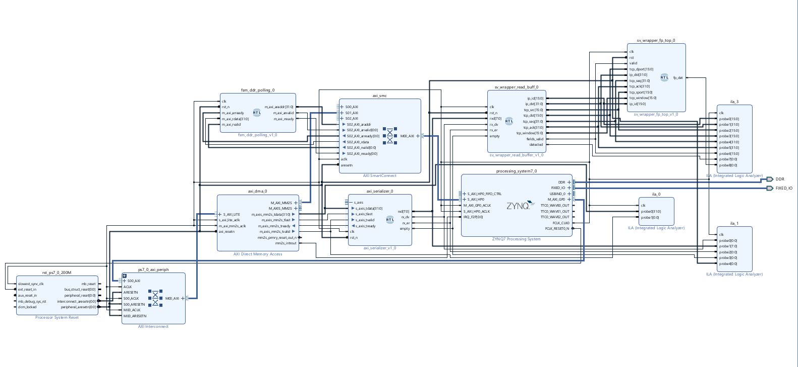

# IP MAC Floating-Point Project

This repository captures the Vivado project for the MAC floating-point IP that we use in the SIVP lab. The repository is intentionally lightweight so it can be cloned and opened directly inside Vivado without any manual migrations.

## Requirements
- Vivado Design Suite 20.x or earlier (matches the version the project was created with).
- Vitis (bundled with Vivado 20.x), since several project settings and generated files depend on it.

## Open the Project
1. Launch Vivado 20.x (or an earlier 2020 release).
2. Navigate to **File > Project > Open...**.
3. Select `IP_MAC_FP/IP_MAC_FP.xpr` from this repository and allow Vivado to load the project assets.

## Verify the Block Design
After Vivado finishes loading, open the block diagram from the Block Design pane to confirm that the expected design is present. You should see a diagram identical to the reference screenshot below. If the block diagram fails to load, double-check that you opened the `.xpr` file packaged with this repo and that no IP cores are missing.

## Repository Layout
- `IP_MAC_FP/` - Vivado project directory containing sources, constraints, and block diagram files.
- `IP_MAC_FP/block_diagram.png` - Reference image showing the expected block design topology.

## Notes
- Keep the project within a path that does not include spaces or non-ASCII characters so Vivado can regenerate derived files without errors.
- When committing changes, avoid checking in the `IP_MAC_FP.cache` and other build artifacts that Vivado can regenerate; focus on RTL, constraints, and project configuration.
